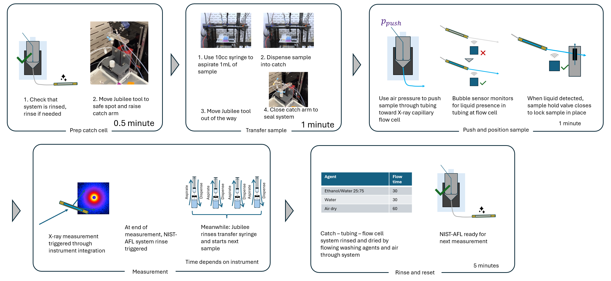

# AFL Pneumatic Sample Loader
This is a fork of the [NIST Autonomous Formulation Laboratory (AFL)](https://www.nist.gov/ncnr/ncnr-facility-upgrades/autonomous-formulation-lab-afl) sample loading system. It has been modified and extended to integrate with the [Science-Jubilee open automation platform](https://science-jubilee.readthedocs.io/en/latest/). 

The AFL sample loader provides the ability to transfer liquid samples from the deck of a Jubilee (or other similar liquid handling robot) to a measurement flow cell. It was originally developed for small-angle scattering experiments, and this implementation was also built with SAXS measurements in mind. However, it is in principle extensible to any measurement that supports a liquid flow cell sample environment. This system provides an important means to extend the capability of automated experimentation workflows to include characterization, building baseline infrastructure to enable autonomous experimentation or "self-driving labs". We have successfully used this system to fully automate the synthesis and characterization of mesoporous colloidal silicas using both our in-house SAXS instrument as well as the Advanced Photon Source 12-ID-E USAXS beamline. 

The system consists of a 'catch' and 'piston' assembly mounted to a swing arm clamp. To transfer a sample to a flow cell for measurement, the liquid handling robot loads the sample into the 'catch' mounted to it's deck. The clamp arm then closes, sealing the sample system. Air pressure pushes the sample through a length of tubing until it reaches the measurement flow cell. The sample is detected by a bubble/liquid sensor. Once the sample is at the flow cell, a valve closes to hold the sample there during measurement. After measurement, the sample flow path is rinsed to reset for the next sample. 

## Building

A full bill of materials, build instructions, and usage instructions can be found in the [build guide](docs/building.md). If you are seriously considering building this system, make sure to also read up on the current state of the original NIST system - it has likely been improved since we forked it. Find the NIST AFL software [here](https://github.com/usnistgov/AFL-automation), their documentation [here](https://pages.nist.gov/AFL-automation/en/add-docs/index.html), and their AFL landing page [here](https://www.nist.gov/ncnr/ncnr-facility-upgrades/autonomous-formulation-lab-afl). We are also available to discuss build guidance for new users. 

## License

This work, as an extension of the NIST Autonomous Formulations Lab software, is licensed under the [NIST License](LICENSE). This work may be modified and distributed non-commercially. 