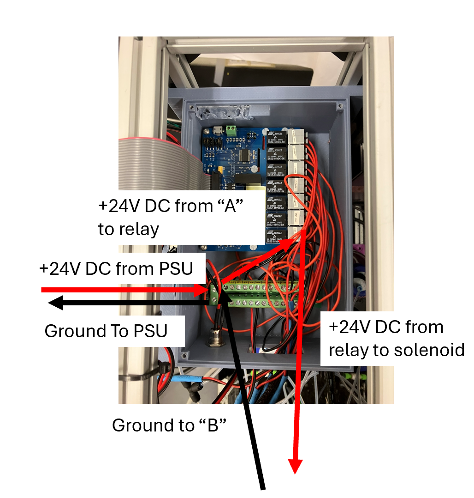

# Build guide

This is a build guide for the Pozzo lab fork of the NIST AFL system. This is how we built it and may not be the way the original NIST designers have built it. In case of conflict, go with the NIST version

## Parts list

- Frame parts:
    - extrusion parts
    - some brackets
    - Piece of acrylic to cut a panel out of

Electronics:
- Raspberry Pi
- Relay plate
- power distribution block
- 24 V power supply. Note ours is kinda sketchy - go with something NRTL listed if you want people to sign off on it
- Labjack. Note you can probably get away with using something else (read cheaper) here, like just using the RPi potentially
- Power entry module
- Bubble sensor
- Various wiring and M12 connectors for panel connections

Pneumatic components:
- 2x static regulators
- digital regulators
- 5/2 valve
- solenoid valves
- 1/4" tubing
- brukert release valve for arm
- PRV valves


Fluidic components:
- Box of 1/4-28 fittings
- 1/8" OD and 1/16" OD PTFE tubing
- check valves
- Pressure plus bottles and caps
- panel pass through fittings

Custom fabricated components:
- Catch and piston

Printed parts:
- Catch mount base thing
- Compute control module thing
- PEM housing
- Various frame brackets
- rinse bottle holders
- 5/2 valve holder


## Build guide:

### Build the frame
The frame is assembled from the extrusion pieces and the corner braces. Assemble it so it is 24" "tall" x 22" "wide" by 4 1/4" "deep". Don't put any brackets on the bottom.


### Wire solenoid valves

We suggest wiring the solenoid valves with a quick-connect connector of your choice to make the rest of assembly and travel easier. Connect the male plug end of your quick connector to the supplied solenoid wiring if the valve came with wires. For the 5/2 valve for the clamp arm, you will need to add wires by removing the screws on the wire caps, removing the caps, and adding wires to the terminals. For the Burkert whisper valve for the piston vent, you will need to either wire your own lead using the specified connectors or buy a cable along with the valve. The Burkert valve mounts to the Jubilee-mounted catch assembly, so make sure the wire for this is long enough to reach. For this valve, pay attention to wiring polarity. Also wire yourself a ~48" connector 'extension' for each valve. Terminate one end of this extension with the female socket of your quick connector and leave the other end unterminated. Use red and black wire for this. All the wire pairs should be a single cable, so either use dual-conductor wire or place both strands in some sort of sheathing like the one suggested in the BOM. At this point, it is a good idea to label every valve. 

| Label | AFL internal name |Valve type | Relay plate number | 
| --- | --- | --- | --- |
| Sample Hold | 'postsample' Mini solenoid cylinder | 1|
| Vent | 'piston-vent' | Burkert whisper | 2 |
| Sample push | 'blow' | Mini solenoid cylinder | 3 |
| Rinse 2 | 'rinse2' | Mini solenoid cylinder | 4 |
| Rinse 1 | 'rinse1' | Mini solenoid cylinder | 5|
| Arm up | 'arm-up' | 5/2 valve A | 6 |
| Arm down | 'arm-down' | 5/2 valve B | 7 | 


### Wire the compute control box

This is a rats nest. This box contains the raspberry pi that controls everything, the PiPlates relayplate that actuates the pneumatics, and power wiring. It is easiest to route all the wires into the box where they need to go, but keep the power distribution block and relay plate loose (don't screw them down yet). Make sure everything will still fit/wires reach/etc once it goes in the box. 


1. Connect a red wire to one of the 'A' terminals on the end of the power distribution block, and a black wire to one of the 'B' blocks. These will be the +24v and ground from your power supply.

2. For each of the 7 solenoid valves you need to: 
    1. Connect an 'A' terminal from the power distribution block to the relay terminal.
    2. connect the red wire from your valve extension wire from above to the other terminal of the relay.
    3. Connect the black wire from the valve extension to the corresponding 'B' terminal on the power distribution block.




3. Now screw everything down to the box using M3 (? maybe 2.5?) screws.

4. Mount the raspberry pi to the standoffs on the lid.

5. Use the raspberry pi female-female ribbon cable to connect the pi to the relay plate, minding the orientation as shown here. 


### Mount connectors to valves

Mount the connectors to the valves as described in the main pneumatic connections figure. Use teflon tape to prevent leaks on NPT connectors.

### Physically mount everything to the frame

Mounte everything to the frame using the 3D printed mounts and brackets. The specific arrangement isn't critical as long as everything clears. Pay attention to which side your panel is going to be on if you are using one - make sure to put the 90* elbow connectors on that side. 


- Most components mount with dedicated 3D printed mounting brackets
- Things mounting to the extrusion use blind-insert T nuts
- The solenoid valves may require a few wraps of PTFE tape to stay secure in their mounting brackets
- The static regulators mount to manufacturer purchased brackets. These brackets mount to the 3D printed mounts with M5 hardware
- Everything else uses M3 hardware directly threaded into plastic, or heat-set M3 inserts. 


### Make electronic connections

Wire everything remaining as shown in the electronic connections diagram.


Notes:
- On our M12 cable for the digital regulator, the yellow cable matches to the analog in pin on the regulator. Double check your cable and the regulator's manual.
- The regulator runs on 24V power
- The bubble sensor does not run on 24V power and in fact will spark and pop if it is asked too. It likes 5V. Buy extras they are cheap.
- Wiring for 1 solenoid valve is shown in the diagram. Again, wire all 7 in the same manner.
- Double check you wire your 120V power entry module to the power supply correctly. Make sure to put fuses in your power entry module.

### Make pneumatic and fluidic connections
Make physical tubing connections as shown in the diagram below. You will need to select appropriate fittings for each tubing connection. Generally speaking,
- 1/16" OD tubing requires a 1/4-28 fitting. Use a 10-32 male to 1/4-28 female adapter to mount these fittings to the solenoid valves.
- 1/8" tubing uses either a 1/4-28 fitting or push to connect fitting
- 1/4" tubing uses push to connect fittings


### Assemble front panel

### Assemble catch assembly


1. Drill and tap M5 holes in Jubilee deck on slot 1 for catch, using the catch block as a template. If you are using the original lab automation deck template, you will also need to remove some material from the back edge. The modified AFL automation deck template does not have this material. 

2. Connect the 1/4" OD x NPT ? push to connect fittings to the clamp. 

3. Mount the clamp to the catch base using the 5/32 x 3" screws. Use washers and assembly lube.

4. Loosely mount the piston to the catch arm by assembling the hardware stack as shown in the picture. The 1/4-20 screw threads into the top of the piston, washers are used to space the piston down from the arm, and a washer and 2 nuts are used on top of the arm to tighten down the assembly. Leave this loose as the number of washers between the arm and the piston may need adjusting. 


5. Mount a sufficiently long amount of 1/16" OD tubing to reach your flow cell to the bottom of the catch, using a 1/4-28 fitting. Be extremely careful not to cross-thread the soft HDPE threads. 

6. Connect a short piece of tubing between the piston and the normally closed port of the whisper valve, using 1/4-28 fittings.

7. Mount the piston arm to the clamp, aligning it so that it is lined up with the catch when closing.

8. Fine tune the washer stack for the piston so that the piston just clears the rim of the catch when the clamp swings over it. 

9. Make the fluidic connections for the piston. Again don't cross thread the HDPE fittings.


- Wire up all your valves using quick-connectors of your choice. This will make assembly and travel easier
- Mount the power components: PSU, PEM. Wire this up. Don't kill yourself here.
- Wire up the solenoid valves. This box will be a mess
- Mount appropriate fittings onto the solenoid valves
- Mount the solenoid valves to the frame
- Make your front panel, if using (not strictly necessary). This is done by measure and manually with a table saw and a drill press
- make all the tubing connections
- Wire up the labjack with regulator out and bubble sensor in things
- Assemble the catch arm
    - If using Jubilee, punch some holes in Jubilee deck to screw this down

- Connection diagram in powerpoint showing how everything fits together
- Some pictures of assembled things

### Assemble to flow cell components

The flow cell components include the Anton-Paar flow cell, a bubble sensor to detect the presence of the sample, and a solenoid valve to hold the sample in place. When a sample is loaded, the bubble detector senses the liquid sample in the tubing, then the system closes the sample hold solenoid valve to hold the sample in place. The solenoid valve needs to be placed down-stream of the flow cell and within a few inches of the flow cell. If it is too far away, the sample will 'drift' after stopping. The sensor should ideally be placed between the flow cell and the solenoid, but its placement is flexible. Timing configurations can be adjusted later in software to get the sample stopping tuned in well.
    Here, we use an Anton-Paar Saxess flow cell. We use these because we have a lot on hand, but they are not readily purchased as far as I can tell. Alternatives include any capillary flow cell that will mount to 1/16" OD tubing that you may have access too. We have also heard that gluing a piece of appropriately sized Kapton tubing into the ends of two pieces of tubing makes a perfectly functional sample cell for SAXS. 

#### Prepare the flow cell
Assuming you are starting from a broken or fouled flow cell:
1. Drill out the old glass and epoxy using a lathe. Have the machine shop take care of this for you.
2. Epoxy a new capillary into place. Completely sealing the edges of the capillary without getting epoxy all over the center of the glass where the beam will be is an art form. 
3. Score the ends of the capillary flush with the end of the threads
4. Sand the ends of the assembled flow cell so that the capillary and the brass are flush, with no rough edges or epoxy protrusions. This is essential to preventing leaks in the next step
5. Determine the appropriate number of shims to include on each end of the flow cell fittings. You need enough shims that the inner O-ring compresses enough to seal before the outer O-ring and threads bottom out. This is a trial and error process. Start with ~3 per side. 
6. Assemble the tubing-shim-o-ring-fitting stack, as shown in the picture. Make sure to start with a clean, square tubing end cut using a tubing cutter tool. The order is 
    - Put the tubing on the tube, with the threaded end facing the end of the tubing you will mount to the flow cell. This will eventually be the tubing that comes from the AFL Jubilee catch bottom, but start with some spare tubing to leak test first.
    - Next put 1 inner O-ring on the tubing
    - Next, the determined number of shims
    - Flange the end of the tubing using a tubing flanging tool.
    - Place an outer O-ring in the seat of the threaded fitting
    - Thread the fitting onto the end of the flow cell, making sure the outer O-ring doesn't get munched.


7. Leak test the flow cell. Carefully clamp one end of the tubing with a c-clamp or similar, enough to stop water flow but not enough to tear the tubing. Install a syringe filled with water onto the other tubing end, using a luer lock to 1/4-28 adapter and a 1/4-28 fitting. Release the clamp and flow some water through the tubing. Close the clamp and gently apply pressure to the syringe, making sure not to burst the capillary. Watch for leaks.
- If water leaks out of the inside of the flow cell, between the brass and the capillary: The epoxy seal is inadequate, drill out the capillary again and start over.
- If water leaks out the inside of the fitting between the stainless fitting and the tubing: Add more shims
- If water leaks out the outside of the fitting, between the brass and the stainless fitting: Less shims or check O-rings are lined up right.
You can also vacuum leak test if using under vacuum.

8. Re-assemble the tubing with the tubing used for the system.

#### Install AFL flow cell components on instrument:

Mount this installation to your instrument as appropriate. At APS, we just taped everything to the sample stage and this worked great. The flow cell was held using a 3D printed holder that mounted in our APS USAXS cartridge plate holder. More details on flow cell [here](https://github.com/pozzo-research-group/Automation-Hardware/tree/master/Cartridge%20Sample%20Holder%20for%20SAS%20Experiments/SAXS-USAXS_AntonPaar_FlowCellHolder) and holder [here](https://github.com/pozzo-research-group/Automation-Hardware/tree/master).  If you are working in a vacuum, you will need to route your input tubing, output waste tubing, sensor wires and valve wires into the vacuum chamber, or experiment with sample stopping settings so you can keep the electronics outside the vacuum. 

- Clip the sensor onto the tubing downstream of the flow cell
- Install the sample hold solenoid valve a few inches downstream of the tubing, using a 10-32 to 1/4-28 adapter and 1/4-28 fitting.
- Route the outlet of the sample hold solenoid valve to a waste container


Flow cell O-rings and spacers:

| Part | Size | McMaster Link |
|---|---|---|
|Inner o rings | 001-1/2 | https://www.mcmaster.com/9464K181/ |
| Inner shims | 0.005" thick x 1/16" ID | https://www.mcmaster.com/99040A945/ |
| Clock pin side outer O-ring | 1mm wide x 6mm ID | https://www.mcmaster.com/9263K111/|
| Non-clock pin side outer O-ring | 1mm wide x 5mm ID | https://www.mcmaster.com/9263K285/ |

### Provision Pi

Assuming you are starting from a fresh install of Raspberry Pi OS 64 bit:
1. Configure raspberry pi networking for your equipment LAN. These instructions assume you are using our default Jubilee Lan configuration, but you can change these values as needed. Our standard network configuration is to give devices a static IP address in the range 192.168.1.x. Here we will assign the AFL pi the ip 192.168.1.4
- Log into your pi for the first time, give it a reasonable username and password, and connect to your wifi network for internet access.
- Plug your pi into the network switch using an ethernet cable. 
- Check if your pi is using NetworkManager of DHCPCD for networking. New installs should use NetworkManager and that is what is shown here. You can do the same setup with DHCPCD although the commands are different. Check by running `systemctl status NetworkManager`, you should see a bunch of active services.
- Get the current wired connection name by running `nmcli connection show`.
- Update the wired connection to assign a static ip: 

```nmcli con modify "Wired connection 1" \
    ipv4.method manual \
    ipv4.addresses 192.168.1.4/24 \
    ipv4.gateway "" \
    ipv4.dns "" \
    connection.autoconnect yes
```

- Reboot
- You should now be able to connect to the pi over your LAN (ie `ping 192.168.1.4` from another connected computer), and also reach the internet.

2. Install the labjack LJM libary. You will need the ARM linux version for the raspberry pi. It currently lives [here](https://support.labjack.com/docs/ljm-software-installer-downloads-t4-t7-t8-digit#LJMSoftwareInstallerDownloads-T4,T7,T8,Digit-LinuxARMv7LJMSoftwareInstallerDownloads). Follow their installation instructions.

3. Create and activate a virtual environment for 

3. Install this version of the AFL control software: 
- Clone the repository somewhere sane
- Install the requirements in `requirements.txt`
- Install this libary - `pip install -e .` from the root of the repo.


## Comissioning 

### Test valve function

Next, check that the valves are all working correctly. Use the [[RelayPlateTesting.ipynb]] notebook to step through all the relays and solenoids. When turning a relay on, you should hear a click and be able to feel it if you hold the solenoid valve. If you hear a quiet click from the control box but don't feel the solenoid click, check your wiring and that the power to the solenoids is on. If you hear nothing, check the RelayPlate configuration. 

### Connect and prepare:
In the next few steps, you will make sure everything works and test things out. 

- Back the supply static regulators all the way out to their lowest pressure by 'unscrewing' the knob. 
- Connect your air supply to the inlet fitting.
- Slowly dial the static regulators in to their target pressures (80 PSI for the clamp arm side and 20PSI for the fluidic side). Stop and investigate if you hear or see anything leaking at this point. 
- Fill the rinse bottles with DI water and put the caps on
- Set the Jubilee module in a safe place on a workbench. The arm wil move in the next few steps, so stay clear.
- Lay out your tubing, flow cell, and flow cell components on your workbench.

### Final software configurations
You will be setting configurations for your system in multiple places. You should take the time to read through each of these and understand what is going on where. 
- `server_scripts/LoaderPneuaticJubilee.py`: This is the script to actually launch the AFL loader process. Configuration here includes the relay number to solenoid assignment, Labjack wiring, and science-jubilee IP address.
- `AFL/automation/loading/PneumaticPressureSampleCellJubilee.py`: This is the main python class that runs the AFL sample loader. Configuration related to the load sequencing including rinse programs and timing are set as class variables of the PneumaticPressureSampleCell class.
- `AFL/automation/loading/LoadStopperDriver.py`: Configurations related to the detection of samples by the bubble detector are set here, as class variables of the LoadStopperDriver class. 

Note that configurations are saved automatically in the `~/.afl` directory. If you make config changes, you need to delete the `LoadStopperDriver.config.json` and/or `PneumaticSampleCell.config.json` files from here then re-boot the flask app for changes to take effect. 

Read through these files and make sure the values there make sense. If you followed the setup directions here, you should not need to change anything. 

### Connect a Jubilee and move it to a safe position

This version of the NIST-AFL is modified to integrate with Jubilee. It contains some low-level Jubilee-dependent safety checks that cannot be disabled. Thus, testing the system will require a Jubilee to connected to the network and positioned in a 'safe' position. By default, safe Jubilee positions are x < 5, y > 200, and z > 100. This can be modified in the instantiation of the jubilee object in the `server_scripts/LoaderPneumaticJubilee.py` file.

1. Connect a Jubilee to the same LAN as your AFL
2. Home the Jubilee
3. Move the Jubilee to satisfy the safe position criteria.

You don't need to actually have the catch assembly mounted on the Jubilee yet. 

### Bring up the app

To start the app, just run the `LoaderPneumaticJubilee.py` script:
`python LoaderPneumaticJubilee.py` from the appropriate directory.

### Connect with the web app GUI:

The AFL comes with a web app that lets you run the main functionality of the system from a GUI. This is useful for testing and development. To access the GUI:

1. Navigate to `http://localhost:5000/app` in the browser
2. Click on the 'Add Server' button in the top right
3. Enter the address of the AFL server: `http://localhost:5000` and click enter

You should now see a GUI panel with buttons to load a sample, rinse the cell, and so on. 


### Connect with Science-Jubilee

The NIST-AFL sample loader is defined in the Science-Jubilee library as the Pneumatic Sample Loader tool. To initialize it:
1. Set up a python Jupyter notebook as usual for Jubilee:
```
from science_jubilee import Machine as Jub
from science_jubilee.tools import PneumaticSampleLoader

jubilee = Jub.Machine(address = '192.168.1.2')
deck = jubilee.load_deck('name_of_deck_config.json')
```
2. Define constants for the Pneumatic sample loader configuration:
```
safe_pos = (5, 200, 100) # safe position, should match what is defined in AFL LoaderPneumaticJubilee.py file
cell_pos = (217.5, 69.0, 61.5) # position of catch on Jubilee deck
url = 'http://192.168.1.4' # URL for AFL pi
port = '5000'
name = 'PSL' 
username = 'controlpc' # credentials to log in, username can be whatever
password = 'domo_arigato' 
```

3. Instantiate and load the PSL tool:

```
psl = PneumaticSampleLoader.PneumaticSampleLoader(url, port, name, cell_pos, safe_pos, username, password)
jubilee.load_tool(psl)
```

#### Connect with HTTP
Under the hood, the AFL runs on an HTTP api. If you are using it with Jubilee, it is strongly suggested to use the Science-Jubilee interface to gain the benefits of tested position management. The HTTP API has been loosely modified to integrate with science-jubilee and you may run into unexpected edge cases running on HTTP requests. HTTP access is included here for completeness. If you are using this system without Jubilee, you should remove the jubilee references and position checking from the PneumaticPressureSampleCellJubilee.py file. HTTP docs written in python requests format.

```
import requests

url = 'http://192.168.1.4:5000'
username = 'controlpc'
password = 'domo_arigato'
```

1. Send a login request:

```
r = requests.post(
    url + "/login",
    json={"username": username, "password": password},
)

```
2. Store the auth token for use with future requests

```
token = r.json()["token"]
self.auth_header = {"Authorization": f"Bearer {token}"}
```

### Basic use 

#### Prepare the cell
Before doing anything, the system needs to be prepared. The system needs to be rinsed, and Science-Jubilee needs to set the arm state to a known value before working with the AFL. 

Using the science-jubilee interface (again, with the Jubilee in a safe position):

```
psl.prepare_cell()
```

This will rinse the cell if the cell is not currently rinsed and raise the arm

Using the web GUI: 
1. Click the 'Rinse cell' button and let the rinse cycle run
2. Raise the arm by clicking the 'Prepare Load' button

Using the HTTP interface:
Under the hood, the AFL uses a task queue. Rather than directly calling an endpoint for an action, you request an action by adding a task to the queue using the `enqueue` endpoint. 

1. Rinse the cell:
```
task = {"task_name": "rinseCell"}
r = requests.post(self.url + "/enqueue", headers=self.auth_header, json=task)
```
`enqueue` will return immediately. You can monitor the rinse status to wait until the rinsing is down by checking the system status:

```
# Get status from HTTP endpoint
r = requests.get(self.url + "/driver_status", headers=self.auth_header)
print("status r code", r.status_code)
print("status: ", r.content)
status_str = r.content.decode("utf-8")
status_list = json.loads(status_str)
```
Watch the 'State' of the cell to change from RINSING to RINSED

2. Prepare the cell by raising the arm:
```
task = {"task_name": "prepareLoad"}
r = requests.post(self.url + "/enqueue", headers=self.auth_header, json=task)
```

#### Load a sample

Now that the cell is rinsed and the arm is raised, you can load your sample into the cell. Again, this is easiest with the Jubilee tool:

```
psl.load_sample(syringe_tool, sample_location, volume)
```
This should work with any tool that exposes aspirate and dispense methods, such as the Digital Pipette/HTTP syringe tool or OT2 Pipette integration. 

If doing it via GUI or HTTP, you are responsible for getting your sample into the catch. Once this is done, click the 'Load sample' button on the GUI, or enqueue the following task with the HTTP API:

```
task = {"task_name": "loadSample", "sampleVolume": volume}
```
Typically, sample volumes of 500 uL -> 1000 uL work well. More than that and it may spray out of the vent valve, less and timing the load stop needs to be really precise. 

Now that the sample is loaded, you can trigger your measurement.
#### Rinse the cell
Once the measurement is complete, you need to rinse the catch/flow cell/tubing system out to prepare for the next sample.

With Jubilee:
```
psl.rinse_cell()
```

With HTTP:
```
task = {"task_name": "rinseCell"}
r = requests.post(afl_url + "/enqueue", headers=auth_header, json=task)
```

With GUI: Just click the "Rinse Cell" button.


### Troubleshooting


### Registering the AFL server as a systemd service 

Once you get everything set up and working well, it is convenient to set up the AFL server as a systemd service so it starts automatically at boot.

1. Write a shell script that activates the virtual environment, moves to the repo directory, and launches the AFL server script:, called `start_afl.sh`

```
cd <path to venv>/bin

source activate  

cd <path to where AFL repo is>/AFL-sample-loader/server_scripts

python LoaderPneumaticJubilee.py
```

2. Set this script to run at startup as a systemd service: 

- cd to `/etc/systemd/system`
- create a new file named afl_server.service: `sudo nano afl_server.service`
- Enter the following contents:
```
After=network.target

[Service]
Type=simple
ExecStart=/bin/bash <absolute path to script from step 1>/start_afl.sh
WorkingDirectory=<abosolute path to home directory>
StandardOutput=inherit
StandardError=inherit
Restart=always
User=<name of pi username>
#Group=user_group

[Install]
WantedBy=multi-user.target 
```

3. Reload systemd: `sudo systemctl daemon-reload`
4. Register the service to start at bootup: `sudo systemctl enable afl_server.service`
5. reboot
6. Make sure it came up at boot: `systemctl status myscript.service`

## Troubleshooting and tweaking:
- Getting the arm and catch positioned right
- Tuning the load stop parameters
    - Make sure resistance is reasonable for your system, tweak with jumper
    - will need to adjust load detection to work with your system

- 
